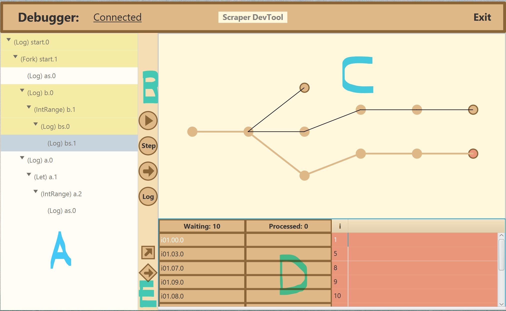

# Scraper-Debugger-Plugin

Desktop debugger tool for [ScraperFlow](https://github.com/scraperflow/scraperflow) programming framework. Provided as plugin via `jar` files. 

# Overview

* `A:` Control-flow graph. `ctrl + left-click` to navigate. `ctrl + shift + left-click` to set breakpoint.
* `B:` `execution`, `step` and `continue` buttons for all flows.
* `C:` Dynamic flow graph. `left-click` to inspect flow-map. `ctrl + left-click` to inspect flow states.
* `D` Shows flow states or the flow-map for one selected flow.
* `E:` `step` and `continue` buttons for one selected flow.

# Quickstart - Debugging
By using the start script in `~/opt/scraperflow` you can start the debugger via `./scraperflow file.yml debug`

# Quickstart - Java
* Execute `mvn install`. 
* This will generate `backend/target` and `frontend/target` folders that contain a `zip` file.
* Extract jars from `zip` files to `~/opt/scraperflow/var` folder.

# Debugger Limits
* Program `cfg` should form a tree.
* Tree should have `height < 20` and  `width < 16`.
* Nodes should be configured to provide enough threads.
